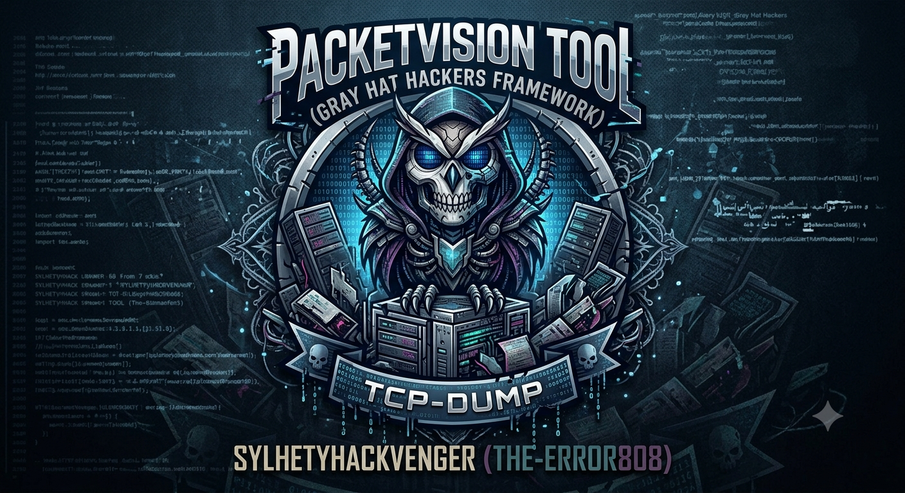
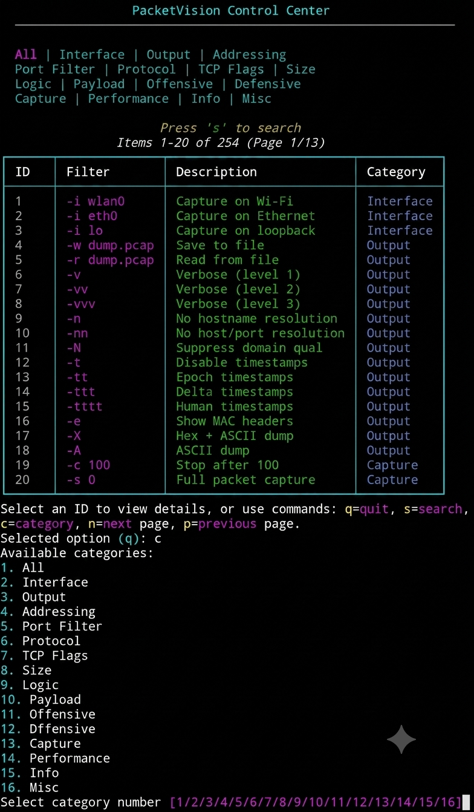

# PacketVision
## Educational TCP-Dump Framework for Gray Hat Hackers

### Author: SYLHETYHACKVENGER (THE-ERROR808)

---



---

## 📡 Description

**PacketVision** is an advanced educational framework designed to bridge the gap between network security theory and practical packet analysis using `tcpdump`. Developed by SYLHETYHACKVENGER (THE-ERROR808), this interactive tool provides security professionals, network administrators, and cybersecurity students with hands-on experience in network traffic analysis.

The framework features an extensive database of **255 carefully curated tcpdump filters**, each categorized and explained to facilitate deep understanding of network protocols, security threats, and defensive strategies. By combining interactive learning with real-world packet capture execution, PacketVision transforms theoretical knowledge into practical skills.

### 🎯 Core Philosophy

PacketVision operates on the principle that understanding network traffic is fundamental to both offensive and defensive security operations. The tool empowers users to:
- Explore network protocols through practical examples
- Understand security implications of different traffic patterns
- Practice ethical packet analysis in controlled environments
- Bridge theoretical concepts with hands-on implementation

---

## 🖥️ Interactive Dashboard

The PacketVision dashboard serves as the central command center for exploring 255 distinct tcpdump features, organized into intuitive categories:

### 📊 Feature Categories

| Category | Count | Description |
|----------|-------|-------------|
| **Interface** | 3 | Network interface selection for packet capture |
| **Output** | 17 | Output formatting, verbosity, and file management |
| **Addressing** | 20 | IP, MAC, and network addressing filters |
| **Port Filter** | 38 | Application-specific port filtering |
| **Protocol** | 20 | Protocol-specific packet inspection |
| **TCP Flags** | 30 | TCP flag analysis for connection states |
| **Size** | 30 | Packet size, TTL, and fragmentation filters |
| **Logic** | 30 | Complex filter combinations |
| **Payload** | 30 | Deep packet inspection and payload analysis |
| **Offensive** | 20 | Penetration testing oriented filters |
| **Defensive** | 15 | Security monitoring and threat detection |
| **Capture** | 5 | Capture control and limits |
| **Performance** | 4 | Performance optimization parameters |
| **Info** | 3 | Informational commands |



### 🎨 Dashboard Features

The interactive dashboard provides:
- **Category Navigation**: Browse filters by functional category
- **Search Functionality**: Quickly locate specific filters or descriptions
- **Pagination**: Navigate through the extensive database efficiently
- **Detailed Views**: Access comprehensive explanations for each filter
- **Real-time Execution**: Run selected filters against your network interface

---

## 🔍 Educational Focus

### What You'll Learn

1. **Network Protocol Fundamentals**
   - TCP/IP stack analysis
   - Protocol identification and behavior
   - Header structure and field interpretation

2. **Security Analysis Techniques**
   - Attack pattern identification
   - Vulnerability assessment through traffic analysis
   - Anomaly detection methodologies

3. **Practical tcpdump Usage**
   - Filter construction and combination
   - Performance optimization strategies
   - Output formatting for analysis

4. **Ethical Considerations**
   - Legal implications of packet capture
   - Responsible security testing practices
   - Authorization requirements

---

## 🛠️ Installation & Requirements

### Prerequisites

```bash
# Required packages
pip install rich
sudo apt-get/pkg  install tcpdump espeak  # Debian/Ubuntu
# or
brew install tcpdump espeak          # macOS

git clone https://github.com/SYLHETYHACKVENGER/PacketVision.git
cd PacketVision
sudo python pkv.py

Command Function
s Search filter database
c Change category view
n Next page
p Previous page
q Quit application

Selection Process

1. Browse the database through categorized views
2. Select a filter ID to view detailed information
3. Understand the filter's purpose, mechanism, and implications
4. Execute the filter against your chosen network interface
5. Analyze real-time packet capture results

Voice Assistance

The framework includes text-to-speech functionality using espeak to read filter explanations and consequences, aiding auditory learners and providing hands-free operation.

---

⚠️ Disclaimer & Ethics

PacketVision is strictly for educational and research purposes. The tool is designed to:

· ✅ Enhance understanding of network protocols
· ✅ Develop practical packet analysis skills
· ✅ Recognize attack patterns and defensive strategies
· ❌ Never be used against networks without explicit authorization
· ❌ Never be used for illegal surveillance or data interception

Remember: Security testing without permission is illegal and unethical. Always obtain proper authorization before conducting packet captures on any network.

---

🎯 Use Cases

For Security Students

· Practice hands-on with real network traffic
· Understand theoretical concepts in practice
· Build confidence in network security operations

For Network Administrators

· Troubleshoot network issues effectively
· Monitor for security anomalies
· Optimize network performance through analysis

For Penetration Testers

· Validate security controls
· Identify potential vulnerabilities
· Demonstrate proof-of-concept attacks

For Security Engineers

· Develop intrusion detection signatures
· Analyze incident response data
· Create custom monitoring solutions

---

🔧 Technical Architecture

Core Components

1. Database Layer: 255 predefined filters with metadata
2. UI Layer: Rich interactive dashboard with categories
3. Execution Layer: Secure tcpdump command execution
4. Voice Layer: Text-to-speech for educational support

Filter Database Structure

Each filter entry includes:

· Filter Syntax: Actual tcpdump command components
· Description: Plain language explanation
· Category: Functional grouping
· Explanation: Detailed technical breakdown
· Purpose: Why this filter is useful
· Consequences: Security and performance implications

---

📚 Learning Pathways

Beginner Pathway

1. Start with basic interface selection
2. Explore simple addressing filters
3. Practice with protocol filtering
4. Understand output formats

Intermediate Pathway

1. Combine filters with logical operators
2. Analyze TCP flag patterns
3. Capture and analyze real traffic
4. Investigate payload patterns

Advanced Pathway

1. Build complex custom filters
2. Perform offensive security analysis (in authorized environments)
3. Develop defensive monitoring strategies
4. Create automated analysis workflows

---

🤝 Contributing

Contributions to PacketVision are welcome! Areas for contribution include:

· New Filters: Expanding the database with additional filters
· Documentation: Improving explanations and examples
· Bug Fixes: Identifying and resolving issues
· Feature Enhancements: Adding new capabilities

---

🎬  

<p align="center">
  
</p>

Experience the power of packet analysis in action.

---

📄 License

This project is licensed under the MIT License - see the LICENSE file for details.

---

🙏 Acknowledgments

· tcpdump developers for the foundational tool
· Rich library for beautiful terminal interfaces
· espeak developers for text-to-speech support
· Open-source community for continuous inspiration

---

📬 Contact

Author: SYLHETYHACKVENGER (THE-ERROR808)
GitHub: @SYLHETYHACKVENGER

---

"With great power comes great responsibility. Use PacketVision to learn, understand, and protect - never to exploit or harm."

---

📝 Changelog

v1.0.0

· Initial release with 255 filters
· Comprehensive category organization
· Interactive dashboard with search
· Voice assistance integration
· Real-time tcpdump execution

---

Start your journey into network packet analysis today with PacketVision! 🚀

```
